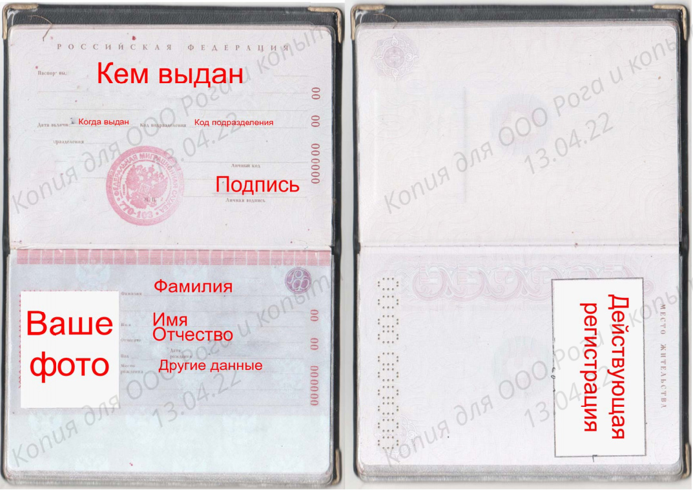

# Водяные знаки для сканов документов

Накладывает водяные знаки на изображения. Полезно для сканов документов, которые нужно кому-то отправить. Можно задавать параметры: цвет надписи, прозрачность, угол наклона и др.
Пока умеет обрабатывать только по одному изображению за раз (я пробовал только png), и не умеет работать с pdf.

## Запуск
Обязательных параметров два: имя изображения и адресат, для кого делаем копию. Самый простой пример запуска: `./watermark.sh in.png --for 'Рога и копыта'`

## Параметры
Остальные параметры не обязательные, у них есть значения по умолчанию.
- `date`    Дата (строка, поэтому можно в любом формате). default `текущая дата`
- `color`   Цвет в формате RGB. default `255,255,255`
- `tr`      Прозрачность, можно использовать дроби. default `0.4`
- `size`    Размер (масштаб) надписи. Чем больше значение, тем крупнее надпись default `600`
- `border`  Рамка по краям, куда не наносится надпись (кажется сейчас криво работает, лучше оставить значение по-умолчанию). default `30` 
- `rotate`  Градус поворота надписи. default `30`

## Возможные проблемы
- **Надпись плохо видно**. В зависимости от документа, могут лучше подходить черные или белые надписи. По дефолту подставляется белая, но если ее почти не видно, надо поэкспериментировать с параметрами `color` и `tr`. Например, может подойти такой вариант: `./watermark.sh in.png --for 'Рога и копыта' --color 0,0,0 --tr 0.05`
- **Надпись слишком крупная или мелкая**. Поэкспериментируй с параметром `size`. 

## Пример

